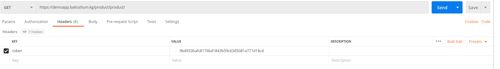
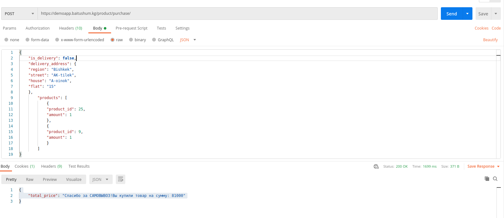
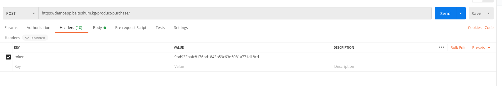
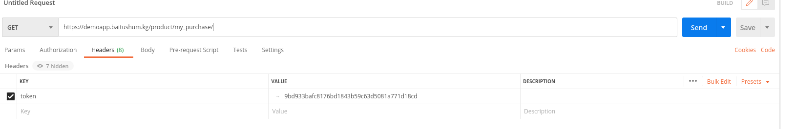

# APPLICATION PRODUCT

##### List of links 

>1. [Top sales](#get-list-of-top-sales)
>2. [Product card](#get-list-of-product-card)
>2. [Search in product card ](#search-in-list-of-product-card)
>3. [Scope](#get-list-of-scope-of-product )
>4. [Attributte type](#get-list-of-attribute-type)
>7. [Attribute ](#get-list-attribute-of-product)
>5. [Category](#get-list-of-category)
>6. [Sub category](#get-list-of-sub_category)
>7. [Brand](#get-list-of-brand)
>8. [Product](#get-list-of-product)
>9. [Purchase](#get-list-of-purchase)

>10. [Create a purchase](#create-a-purchase)

>11. [My purchase](#get-list-of-my-purchase)
>12. [Similar product](#get-similar-products-by-card-id)

## Get list of top sales
#### Request method: GET

## [/product/top_sales/](https://demoapp.baitushum.kg/product/top_sales/) 

### Sample response

	{
    "count": 3,
    "next": null,
    "previous": null,
    "results": [
        {
            "id": 17,
            "card_image": "https://demoapp.baitushum.kg/media/product_card/err_serv_.png",
            "card_name": "Xioami Redmi note 9",
            "price": 23000
        },
        {
            "id": 18,
            "card_image": "https://demoapp.baitushum.kg/media/product_card/Samsung-S20-BTS-Edition.jpg",
            "card_name": "Samsung Galaxy S20",
            "price": 10000
        },
        {
            "id": 22,
            "card_image": "https://demoapp.baitushum.kg/media/product_card/refrigerator_PNG9035.png",
            "card_name": "Холодильник   Xiaomi",
            "price": 23000
        }
        ]
    }
    
## Get list of product card
#### Request method: GET

## [/product/card/](https://demoapp.baitushum.kg/product/card/) 

### Sample response

	{
	    "count": 20,
	    "next": "https://demoapp.baitushum.kg/product/card/?page=2",
	    "previous": null,
	    "results": [
		{
		    "id": 4,
		    "card_name": "Телевизоры Смарт XIAOMI MI TV 4A 32 81 см",
		    "card_image": "https://demoapp.baitushum.kg/media/product_card/xiaomi-mi-tv-4a-32-81-sm-cernyj-1801503-1.webp",
		    "price_min": 0,
		    "price_max": 0
		},
		{
		    "id": 5,
		    "card_name": "Телевизор LED Samsung UE50NU7090U 125 см черный",
		    "card_image": "https://demoapp.baitushum.kg/media/product_card/imagesassas.jpeg",
		    "price_min": 0,
		    "price_max": 0
		},
		{
		    "id": 6,
		    "card_name": "Thomas Graf SCMLW0130_173 однотонная синяя XL",
		    "card_image": "https://demoapp.baitushum.kg/media/product_card/f1.png",
		    "price_min": 0,
		    "price_max": 0
		},
		{
		    "id": 7,
		    "card_name": "DeFacto N3733AZ в полоску коричневый S",
		    "card_image": "https://demoapp.baitushum.kg/media/product_card/p1.jpeg",
		    "price_min": 0,
		    "price_max": 0
		}
	      ]
	      }
     
             
## Get an item of product card
#### Request method: GET

## [/product/card/{id}/](https://demoapp.baitushum.kg/product/card/1/) 

### Sample response
	{
	    "id": 4,
	    "card_name": "Телевизоры Смарт XIAOMI MI TV 4A 32 81 см",
	    "attribute_type": [
		{
		    "id": 3,
		    "name": "Размер",
		    "tag_attribute_type": "SIZE",
		    "attributes": [
			{
			    "id": 13,
			    "name": "S-XL",
			    "attribute_type": 3,
			    "tag_attribute": null
			}
		    ]
		}
	    ],
	    "category": {
		"id": 1,
		"name": "Электроника",
		"image": "https://demoapp.baitushum.kg/media/category/Screenshot_from_2020-09-15_11-08-15_VxLQMFT.png"
	    },
	    "sub_category": {
		"id": 4,
		"name": "Телевизоры",
		"category_name": "Электроника"
	    },
	    "brand": {
		"id": 4,
		"name": "XIAOMI",
		"description": "",
		"logo": "https://demoapp.baitushum.kg/media/brand/images.png"
	    },
	    "scope": {
		"id": 1,
		"name": "Товар"
	    },
	    "card_gallery": [
		{
		    "id": 11,
		    "card": 4,
		    "image": "https://demoapp.baitushum.kg/media/product_card/xiaomi-mi-tv-4a-32-81-sm-cernyj-1801503-2.webp"
		},
		{
		    "id": 12,
		    "card": 4,
		    "image": "https://demoapp.baitushum.kg/media/product_card/xiaomi-mi-tv-4a-32-81-sm-cernyj-1801503-1_zhvpX3H.webp"
		},
		{
		    "id": 44,
		    "card": 4,
		    "image": "https://demoapp.baitushum.kg/media/product_card/Screenshot_from_2020-08-20_16-36-55.png"
		}
	    ],
	    "price_min": 0,
	    "price_max": 100000000,
	    "products": []
	}
	
	
## Search in list of product card
#### Request method: GET

## [/product/brand/?search=Телевиз&ordering=id](https://demoapp.baitushum.kg/product/card/?search=Телевиз&ordering=id) 

### Sample response

	{
	    "count": 3,
	    "next": null,
	    "previous": null,
	    "results": [
		{
		    "id": 4,
		    "card_name": "Телевизоры Смарт XIAOMI MI TV 4A 32 81 см",
		    "card_image": "https://demoapp.baitushum.kg/media/product_card/xiaomi-mi-tv-4a-32-81-sm-cernyj-1801503-1.webp",
		    "price_min": 0,
		    "price_max": 0
		},
		{
		    "id": 5,
		    "card_name": "Телевизор LED Samsung UE50NU7090U 125 см черный",
		    "card_image": "https://demoapp.baitushum.kg/media/product_card/imagesassas.jpeg",
		    "price_min": 0,
		    "price_max": 0
		},
		{
		    "id": 21,
		    "card_name": "Телевизор Samsung",
		    "card_image": "https://demoapp.baitushum.kg/media/product_card/%D0%91%D0%B5%D0%B7_%D0%BD%D0%B0%D0%B7%D0%B2%D0%B0%D0%BD%D0%B8%D1%8F.jpeg",
		    "price_min": 23000,
		    "price_max": 76900
		}
	    ]
	}	
	
	
## Get list of scope of product
#### Request method: GET

## [/product/scope/](https://demoapp.baitushum.kg/product/scope/) 

### Sample response

	{
	    "count": 2,
	    "next": null,
	    "previous": null,
	    "results": [
		{
		    "id": 1,
		    "name": "Товар"
		},
		{
		    "id": 2,
		    "name": "Услуга"
		}
	    ]
	  }

## Get an item of scope of product
#### Request method: GET

## [/product/scope/{id}/](https://demoapp.baitushum.kg/product/scope/) 

### Sample response

	{
	    "id": 1,
	    "name": "Товар"
	}

## Get list of attribute type 
#### Request method: GET

## [/product/attribute_type/](https://demoapp.baitushum.kg/product/attribute_type/) 

### Sample response

	{
    "count": 12,
    "next": "https://demoapp.baitushum.kg/product/attribute_type/?page=2",
    "previous": null,
    "results": [
        {
            "id": 1,
            "name": "Цвет",
            "tag_attribute_type": "COLOR",
            "attributes": [
                {
                    "id": 1,
                    "name": "белый",
                    "attribute_type": 1,
                    "tag_attribute": "#ffffff"
                },
                {
                    "id": 2,
                    "name": "черный",
                    "attribute_type": 1,
                    "tag_attribute": "#000000"
                },
                {
                    "id": 8,
                    "name": "синяя",
                    "attribute_type": 1,
                    "tag_attribute": "#2f5dde"
                },
                {
                    "id": 11,
                    "name": "коричневй",
                    "attribute_type": 1,
                    "tag_attribute": "#b5792b"
                },
                {
                    "id": 17,
                    "name": "серая",
                    "attribute_type": 1,
                    "tag_attribute": "#959aa6"
                },
                {
                    "id": 20,
                    "name": "черный",
                    "attribute_type": 1,
                    "tag_attribute": "#000000"
                }
            ]
        },
        {
            "id": 11,
            "name": "Памятьт",
            "tag_attribute_type": "STORAGE",
            "attributes": [
                {
                    "id": 35,
                    "name": "64GB",
                    "attribute_type": 11,
                    "tag_attribute": "STOREAGE"
                },
                {
                    "id": 36,
                    "name": "128GB",
                    "attribute_type": 11,
                    "tag_attribute": "STORAGE"
                },
                {
                    "id": 37,
                    "name": "256GB",
                    "attribute_type": 11,
                    "tag_attribute": "STORAGE"
                }
            ]
        }
    ]
	}
	

## Get an item of attribute type 
#### Request method: GET

## [/product/attribute_type/{id}/](https://demoapp.baitushum.kg/product/attribute_type/) 

### Sample response

	{
    "id": 1,
    "name": "Цвет",
    "tag_attribute_type": "COLOR",
    "attributes": [
        {
            "id": 1,
            "name": "белый",
            "attribute_type": 1,
            "tag_attribute": "#ffffff"
        },
        {
            "id": 2,
            "name": "черный",
            "attribute_type": 1,
            "tag_attribute": "#000000"
        },
        {
            "id": 8,
            "name": "синяя",
            "attribute_type": 1,
            "tag_attribute": "#2f5dde"
        },
        {
            "id": 11,
            "name": "коричневй",
            "attribute_type": 1,
            "tag_attribute": "#b5792b"
        },
        {
            "id": 17,
            "name": "серая",
            "attribute_type": 1,
            "tag_attribute": "#959aa6"
        },
        {
            "id": 20,
            "name": "черный",
            "attribute_type": 1,
            "tag_attribute": "#000000"
        }
    ]
	}

## Get list attribute of product
#### Request method: GET

## [/product/attribute/](https://demoapp.baitushum.kg/product/attribute/) 

### Sample response

	{
    "count": 30,
    "next": "https://demoapp.baitushum.kg/product/attribute/?page=2",
    "previous": null,
    "results": [
        {
            "id": 1,
            "name": "белый",
            "attribute_type": 1,
            "tag_attribute": "#ffffff"
        },
        {
            "id": 2,
            "name": "черный",
            "attribute_type": 1,
            "tag_attribute": "#000000"
        },
        {
            "id": 3,
            "name": "S",
            "attribute_type": 3,
            "tag_attribute": null
        },
        {
            "id": 4,
            "name": "M",
            "attribute_type": 3,
            "tag_attribute": null
        },
        {
            "id": 8,
            "name": "синяя",
            "attribute_type": 1,
            "tag_attribute": "#2f5dde"
        },
        {
            "id": 9,
            "name": "S-XL",
            "attribute_type": 3,
            "tag_attribute": null
        },
        {
            "id": 11,
            "name": "коричневй",
            "attribute_type": 1,
            "tag_attribute": "#b5792b"
        },
        {
            "id": 13,
            "name": "S-XL",
            "attribute_type": 3,
            "tag_attribute": null
        },
        {
            "id": 17,
            "name": "серая",
            "attribute_type": 1,
            "tag_attribute": "#959aa6"
        },
        {
            "id": 20,
            "name": "черный",
            "attribute_type": 1,
            "tag_attribute": "#000000"
        }
    ]
	}

## Get an item of attribute 
#### Request method: GET

## [/product/attribute/{id}/](https://demoapp.baitushum.kg/product/attribute/1/) 

### Sample response

	{
	    "id": 1,
	    "name": "белый",
	    "attribute_type": 1,
	    "tag_attribute": "#ffffff"
	}

## Get list of category 
#### Request method: GET

## [/product/category/](https://demoapp.baitushum.kg/product/category/) 

### Sample response

	{
    "count": 15,
    "next": "https://demoapp.baitushum.kg/product/category/?page=2",
    "previous": null,
    "results": [
        {
            "id": 1,
            "name": "Электроника",
            "image": "https://demoapp.baitushum.kg/media/category/Screenshot_from_2020-09-15_11-08-15_VxLQMFT.png"
        },
        {
            "id": 2,
            "name": "Одежда",
            "image": "https://demoapp.baitushum.kg/media/category/schoolwear_DzxOWaX.jpg"
        },
        {
            "id": 3,
            "name": "Спорт товары",
            "image": "https://demoapp.baitushum.kg/media/category/%D1%81%D0%BF%D0%BE%D1%80%D1%82_%D1%82%D0%BE%D0%B2%D0%B0%D1%80%D1%8B_bSWJ0Jf.png"
        },
        {
            "id": 4,
            "name": "Авто товары",
            "image": "https://demoapp.baitushum.kg/media/category/%D0%B0%D0%B2%D1%82%D0%BE_%D1%82%D0%BE%D0%B2%D0%B0%D1%80%D1%8B_HWw2uNF.jpeg"
        },
        {
            "id": 7,
            "name": "Строй товары",
            "image": "https://demoapp.baitushum.kg/media/category/%D1%81%D1%82%D1%80%D0%BE%D0%B9_%D0%BC%D0%B0%D1%80%D0%BA%D0%B5%D1%82_vOnmgAq.jpg"
        },
        {
            "id": 8,
            "name": "Красота и здоровье",
            "image": "https://demoapp.baitushum.kg/media/category/%D0%B7%D0%B4%D0%BE%D1%80%D0%BE%D0%B2%D1%8C%D0%B5_vXkhYTH.jpg"
        },
        {
            "id": 9,
            "name": "Украшения и аксессуары",
            "image": "https://demoapp.baitushum.kg/media/category/%D1%83%D0%BA%D1%80%D0%B0%D1%88%D0%B5%D0%BD%D0%B8%D1%8F_ie5Xz0L.jpeg"
        },
        {
            "id": 11,
            "name": "Смартфоны",
            "image": "https://demoapp.baitushum.kg/media/category/Screenshot_from_2020-09-15_11-06-57_OE8vS8e.png"
        },
        {
            "id": 12,
            "name": "Бытовая техника",
            "image": "https://demoapp.baitushum.kg/media/category/Screenshot_from_2020-09-15_11-07-05_KmqPQrI.png"
        },
        {
            "id": 13,
            "name": "Мебель",
            "image": "https://demoapp.baitushum.kg/media/category/Screenshot_from_2020-09-15_11-07-22_98arP18.png"
        }
    ]
	}

## Get an item of category or get all products by category
#### Request method: GET

## [/product/category/{id}/](https://demoapp.baitushum.kg/product/category/1/)

### Sample response

	{
	    "count": 8,
	    "next": null,
	    "previous": null,
	    "results": [
		{
		    "id": 4,
		    "card_name": "Телевизоры Смарт XIAOMI MI TV 4A 32 81 см",
		    "card_image": "https://demoapp.baitushum.kg/media/product_card/xiaomi-mi-tv-4a-32-81-sm-cernyj-1801503-1.webp",
		    "price_min": 0,
		    "price_max": 0
		},
		{
		    "id": 5,
		    "card_name": "Телевизор LED Samsung UE50NU7090U 125 см черный",
		    "card_image": "https://demoapp.baitushum.kg/media/product_card/imagesassas.jpeg",
		    "price_min": 0,
		    "price_max": 0
		},
		{
		    "id": 13,
		    "card_name": "Apple iPhone 11 64Gb черный",
		    "card_image": "https://demoapp.baitushum.kg/media/product_card/apple2_ha68eTy.jpeg",
		    "price_min": 82000,
		    "price_max": 82000
		},
		{
		    "id": 14,
		    "card_name": "Смартфон Apple iPhone 11 64Gb белый",
		    "card_image": "https://demoapp.baitushum.kg/media/product_card/images.jpeg",
		    "price_min": 0,
		    "price_max": 0
		},
		{
		    "id": 15,
		    "card_name": "Браслет Xiaomi Mi Smart Band 4 черный",
		    "card_image": "https://demoapp.baitushum.kg/media/product_card/images_2.jpeg",
		    "price_min": 0,
		    "price_max": 0
		},
		{
		    "id": 17,
		    "card_name": "Xioami Redmi note 9",
		    "card_image": "https://demoapp.baitushum.kg/media/product_card/err_serv_.png",
		    "price_min": 23000,
		    "price_max": 76000
		},
		{
		    "id": 18,
		    "card_name": "Samsung Galaxy S20",
		    "card_image": "https://demoapp.baitushum.kg/media/product_card/Samsung-S20-BTS-Edition.jpg",
		    "price_min": 10000,
		    "price_max": 78000
		},
		{
		    "id": 23,
		    "card_name": "Xioami Redmi note 10",
		    "card_image": "https://demoapp.baitushum.kg/media/product_card/err_serv__ldlhlcQ.png",
		    "price_min": 0,
		    "price_max": 0
		}
	    ]
	}

## Get list of sub_category 
#### Request method: GET

## [/product/sub_category/](https://demoapp.baitushum.kg/product/sub_category/) 

### Sample response

	{
	    "count": 47,
	    "next": "https://demoapp.baitushum.kg/product/sub_category/?page=2",
	    "previous": null,
	    "results": [
		{
		    "id": 1,
		    "name": "Телефоны",
		    "category_name": "Электроника"
		},
		{
		    "id": 2,
		    "name": "Компьютеры и ноутбуки",
		    "category_name": "Электроника"
		},
		{
		    "id": 3,
		    "name": "Гаджеты",
		    "category_name": "Электроника"
		},
		{
		    "id": 4,
		    "name": "Телевизоры",
		    "category_name": "Электроника"
		},
		{
		    "id": 5,
		    "name": "Холодильник",
		    "category_name": "Бытовая техника"
		},
		{
		    "id": 6,
		    "name": "Для мужчин",
		    "category_name": "Одежда"
		},
		{
		    "id": 7,
		    "name": "Для женщин",
		    "category_name": "Одежда"
		},
		{
		    "id": 8,
		    "name": "Для женщин",
		    "category_name": "Одежда"
		},
		{
		    "id": 9,
		    "name": "Для девочек",
		    "category_name": "Одежда"
		},
		{
		    "id": 10,
		    "name": "Для мальчиков",
		    "category_name": "Одежда"
		}
	    ]
	}
	
## Get an item of sub_category or get products by sub_category
#### Request method: GET

## [/product/sub_category/{id}/](https://demoapp.baitushum.kg/product/sub_category/1/) 

### Sample response

	{
	    "name": "Телефоны",
	    "product_card": [
		{
		    "id": 13,
		    "card_name": "Apple iPhone 11 64Gb черный",
		    "card_image": "/media/product_card/apple2_ha68eTy.jpeg",
		    "price_min": 82000,
		    "price_max": 82000
		},
		{
		    "id": 14,
		    "card_name": "Смартфон Apple iPhone 11 64Gb белый",
		    "card_image": "/media/product_card/images.jpeg",
		    "price_min": 0,
		    "price_max": 0
		},
		{
		    "id": 17,
		    "card_name": "Xioami Redmi note 9",
		    "card_image": "/media/product_card/err_serv_.png",
		    "price_min": 23000,
		    "price_max": 76000
		},
		{
		    "id": 18,
		    "card_name": "Samsung Galaxy S20",
		    "card_image": "/media/product_card/Samsung-S20-BTS-Edition.jpg",
		    "price_min": 10000,
		    "price_max": 78000
		},
		{
		    "id": 23,
		    "card_name": "Xioami Redmi note 10",
		    "card_image": "/media/product_card/err_serv__ldlhlcQ.png",
		    "price_min": 0,
		    "price_max": 0
		}
	    ]
	}
	
## Get list of brand  
#### Request method: GET

## [/product/brand/](https://demoapp.baitushum.kg/product/brand/) 

### Sample response

	{
	    "count": 7,
	    "next": null,
	    "previous": null,
	    "results": [
		{
		    "id": 1,
		    "name": "Apple",
		    "description": "AppleAppleAppleAppleAppleApple",
		    "logo": "https://demoapp.baitushum.kg/media/brand/Screenshot_from_2020-07-10_13-30-58.png"
		},
		{
		    "id": 2,
		    "name": "Samsung",
		    "description": "SamsungSamsungSamsungSamsungSamsung",
		    "logo": "https://demoapp.baitushum.kg/media/brand/Screenshot_from_2020-07-13_17-19-46.png"
		},
		{
		    "id": 3,
		    "name": "Zara",
		    "description": "Zara",
		    "logo": "https://demoapp.baitushum.kg/media/brand/Screenshot_from_2020-07-13_17-19-46_X4T4Tlx.png"
		},
		{
		    "id": 4,
		    "name": "XIAOMI",
		    "description": "",
		    "logo": "https://demoapp.baitushum.kg/media/brand/images.png"
		},
		{
		    "id": 5,
		    "name": "EuroMebel",
		    "description": "EuroMebel",
		    "logo": "https://demoapp.baitushum.kg/media/brand/logoEM.jpeg"
		},
		{
		    "id": 6,
		    "name": "Кузмич",
		    "description": "Кузмич",
		    "logo": "https://demoapp.baitushum.kg/media/brand/WhatsApp_Image_2020-04-11_at_16.15.54_1.jpeg"
		},
		{
		    "id": 7,
		    "name": "Asics",
		    "description": "Мощно",
		    "logo": "https://demoapp.baitushum.kg/media/brand/asics_%D0%B1%D1%80%D0%B5%D0%BD%D0%B4.jpg"
		}
	    ]
	}

	
## Get an item of brand
#### Request method: GET

## [/product/sub_category/{id}/](https://demoapp.baitushum.kg/product/sub_category/1/) 

### Sample response

	{
	    "id": 1,
	    "name": "apple",
	    "description": "appleappleappleappleappleappleapple",
	    "logo": "http://127.0.0.1:8000/media/brand/photo_2020-07-21_10-19-56.jpg"
	}

	
## Get list of product  
#### Request method: GET

#### Requesting headers: Token
## [/product/product/](https://demoapp.baitushum.kg/product/product/) 

### Sample response:

	[
	    {
		"id": 9,
		"price": 5000,
		"branch": {
		    "id": 10,
		    "name": "Adidas Asanbay",
		    "address": "address 2",
		    "logo": "https://demoapp.baitushum.kg/media/store/adidas.jpg",
		    "phone": "+996509055057"
		},
		"quantity": 1,
		"card_id": 8,
		"card_image": "https://demoapp.baitushum.kg/media/product_card/%D0%B21.jpeg",
		"card_name": "Витамины Optimum Nutrition Opti-Men (90 таблеток)",
		"attribute_type": [],
		"is_favourite": false
	    },
	    {
		"id": 21,
		"price": 78000,
		"branch": {
		    "id": 14,
		    "name": "Samsung Bishkek",
		    "address": "г.Бишкек ул Суюнбаева 80",
		    "logo": "https://demoapp.baitushum.kg/media/store/Screenshot_from_2020-09-14_09-43-06.png",
		    "phone": "0550077387"
		},
		"quantity": 200,
		"card_id": 18,
		"card_image": "https://demoapp.baitushum.kg/media/product_card/Samsung-S20-BTS-Edition.jpg",
		"card_name": "Samsung Galaxy S20",
		"attribute_type": [
		    {
			"id": 1,
			"name": "Цвет",
			"tag_attribute_type": "COLOR",
			"attributes": [
			    {
				"id": 1,
				"name": "белый",
				"attribute_type": 1,
				"tag_attribute": "#ffffff"
			    }
			]
		    }
		],
		"is_favourite": true
	    },
	    {
		"id": 22,
		"price": 23000,
		"branch": {
		    "id": 15,
		    "name": "Xioami Bishkek",
		    "address": "г. Бишкек ул. Уметалиева 76",
		    "logo": "https://demoapp.baitushum.kg/media/store/15944015-72FA-3105-CE5C-0C68E04C7BE6.png",
		    "phone": "0550077387"
		},
		"quantity": 200,
		"card_id": 17,
		"card_image": "https://demoapp.baitushum.kg/media/product_card/err_serv_.png",
		"card_name": "Xioami Redmi note 9",
		"attribute_type": [
		    {
			"id": 1,
			"name": "Цвет",
			"tag_attribute_type": "COLOR",
			"attributes": [
			    {
				"id": 1,
				"name": "белый",
				"attribute_type": 1,
				"tag_attribute": "#ffffff"
			    },
			    {
				"id": 2,
				"name": "черный",
				"attribute_type": 1,
				"tag_attribute": "#000000"
			    },
			    {
				"id": 8,
				"name": "синяя",
				"attribute_type": 1,
				"tag_attribute": "#2f5dde"
			    }
			]
		    },
		    {
			"id": 4,
			"name": "USB",
			"tag_attribute_type": "USB",
			"attributes": [
			    {
				"id": 23,
				"name": "3.0",
				"attribute_type": 4,
				"tag_attribute": null
			    }
			]
		    },
		    {
			"id": 5,
			"name": "Память",
			"tag_attribute_type": "STORAGE",
			"attributes": [
			    {
				"id": 25,
				"name": "64 GB",
				"attribute_type": 5,
				"tag_attribute": "64 GB"
			    }
			]
		    }
		],
		"is_favourite": false
	    }
	   ]
	
## Get list of purchase  
#### Request method: GET

## [/product/purchase/](https://demoapp.baitushum.kg/product/purchase/) 

### Sample response

	{
	    "count": 64,
	    "next": "https://demoapp.baitushum.kg/product/purchase/?page=2",
	    "previous": null,
	    "results": [
		{
		    "id": 13,
		    "buyer": 3,
		    "branch": null,
		    "total_price": null
		},
		{
		    "id": 14,
		    "buyer": 3,
		    "branch": null,
		    "total_price": null
		},
		{
		    "id": 42,
		    "buyer": 18,
		    "branch": null,
		    "total_price": null
		},
		{
		    "id": 43,
		    "buyer": 18,
		    "branch": null,
		    "total_price": null
		}
	    ]
	}
## Get an item of purchase
#### Request method: POST
#### Request headers: Token

## [/product/purchase/](https://demoapp.baitushum.kg/product/purchase/) 

### Sample response
	{
	    "id": 13,
	    "buyer": 3,
	    "branch": null,
	    "total_price": null
	}
	
	
## Create a purchase 
#### Request method: POST
#### Request headers: Token

## [/product/purchase/](https://demoapp.baitushum.kg/product/purchase/) 

#### If, is_delivery, wil be TRUE , address will be sent to database and will be saved.And if it will be FALSE, application will screen an addres where client can get order by himself.

### Request body:

	{
	    "is_delivery": false,
	    "delivery_address": {
	    "region": "Bishkek",
	    "street": "AK-tilek",
	    "house": "A-oinok",
	    "flat": "15"
	    },
		"products": [
		    {
		    "product_id": 25,
		    "amount": 1
		    },
		    {
		    "product_id": 9,
		    "amount": 1
		    }
		]
	}

### Sample response

	{
	    "total_price": "Спасибо за САМОВЫВОЗ!Вы купили товар на сумму: 81000"
	}

	

## Get list of my purchase  
#### Request method: GET

#### Request headers: Token

## [/product/my_purchase/](https://demoapp.baitushum.kg/product/my_purchase/) 

### Sample response

	[
	    {
		"id": 55,
		"product": 31,
		"purchase": 52,
		"quantity": 2,
		"price": 34000.0,
		"branch_name": "ЕвроМебель Плаза",
		"branch_phone": "0550077387",
		"card_name": "Шина Tunga NordWay 2 195/65 R15 91Q",
		"card_image": "https://demoapp.baitushum.kg/media/product_card/%D1%861.jpeg",
		"status": "В процессе"
	    },
	    {
		"id": 61,
		"product": 32,
		"purchase": 78,
		"quantity": 1,
		"price": 45000.0,
		"branch_name": "Xioami Bishkek",
		"branch_phone": "0550077387",
		"card_name": "Холодильник   Xiaomi",
		"card_image": "https://demoapp.baitushum.kg/media/product_card/refrigerator_PNG9035.png",
		"status": "В процессе"
	    }
	]
	
	
## Get an item of my purchase

#### Request method: GET
#### Request headers: Token

## [/product/my_purchase/{id}/](https://demoapp.baitushum.kg/product/my_purchase/55/)

### Sample response
	[
	    {
		"id": 55,
		"product": 31,
		"purchase": 52,
		"quantity": 2,
		"price": 34000.0,
		"branch_name": "ЕвроМебель Плаза",
		"branch_phone": "0550077387",
		"card_name": "Шина Tunga NordWay 2 195/65 R15 91Q",
		"card_image": "https://demoapp.baitushum.kg/media/product_card/%D1%861.jpeg",
		"status": "В процессе",
		"card_gallery": [
		    {
			"id": 21,
			"card": 12,
			"image": "https://demoapp.baitushum.kg/media/product_card/%D1%8622.jpeg"
		    },
		    {
			"id": 22,
			"card": 12,
			"image": "https://demoapp.baitushum.kg/media/product_card/%D1%8622_g7X4FQg.jpeg"
		    }
		]
	    }
	]

## Get similar products by card id

#### Request method: GET

### In this endpoint the main idea is to get similar products according to ID. For example, if we will request id of Iphone(mobile phone),as a result we will get only mobile phones related to the card. Moreover, it will be displayed as random, every request will not be ordered by ID.

## [/product/similar_product/{id}/](https://demoapp.baitushum.kg/product/similar_product/13/) 

### Sample response

	[
	    {
		"id": 4,
		"card_name": "Телевизоры Смарт XIAOMI MI TV 4A 32 81 см",
		"card_image": "https://demoapp.baitushum.kg/media/product_card/xiaomi-mi-tv-4a-32-81-sm-cernyj-1801503-1.webp",
		"price_min": 0,
		"price_max": 100000000
	    },
	    {
		"id": 17,
		"card_name": "Xioami Redmi note 9",
		"card_image": "https://demoapp.baitushum.kg/media/product_card/err_serv_.png",
		"price_min": 76000,
		"price_max": 23000
	    },
	    {
		"id": 23,
		"card_name": "Xioami Redmi note 10",
		"card_image": "https://demoapp.baitushum.kg/media/product_card/err_serv__ldlhlcQ.png",
		"price_min": 0,
		"price_max": 100000000
	    },
	    {
		"id": 5,
		"card_name": "Телевизор LED Samsung UE50NU7090U 125 см черный",
		"card_image": "https://demoapp.baitushum.kg/media/product_card/imagesassas.jpeg",
		"price_min": 0,
		"price_max": 100000000
	    },
	    {
		"id": 18,
		"card_name": "Samsung Galaxy S20",
		"card_image": "https://demoapp.baitushum.kg/media/product_card/Samsung-S20-BTS-Edition.jpg",
		"price_min": 78000,
		"price_max": 10000
	    }
	]

--------------------------------------------------------------
