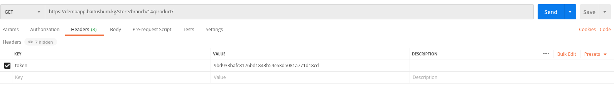
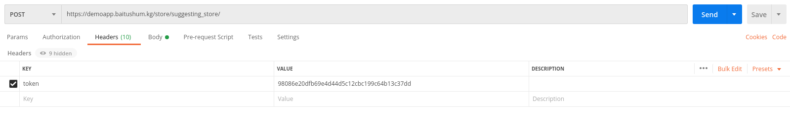
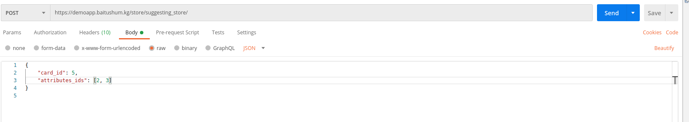

## Application - **STORE**

##### List of links 

>1. [Market banner](#get-list-of-market-banner)
>2. [Region](#get-list-of-region)
>3. [Store](#get-list-of-store )
>4. [Branch by id](#get-branch-by-id)
>7. [Branch products ](#get-branch-products)
>5. [Branch rating ](#get-list-of-branch-rating)
>6. [Branch schedule](#get-list-of-schedule)
>7. [Branch moderator](#get-list-of-branch-moderator)
>2. [Branch main branch](#get-list-of-main-branch)
>2. [Suggesting store](#get-list-of-suggesting-store)

## Get list of market banner 
#### Request method: GET

## [/store/banner/](https://demoapp.baitushum.kg/store/banner/) 

### Sample response:
	[
    {
        "id": 1,
        "title": "Акция 1=3 от Adidas",
        "desc": "Покупайте 3 вещи по одной цене только в наших магазинах города! Спешите акция действует до 1 го сентября!",
        "branch_id": 4,
        "file_link": "https://demoapp.baitushum.kg/media/media/banners/Screenshot_from_2020-08-20_16-36-37.png"
    },
    {
        "id": 2,
        "title": "Акция 1=3 от DeFacto",
        "desc": "Покупайте 3 вещи по одной цене только в наших магазинах города! Спешите акция действует до 1 го сентября!",
        "branch_id": 9,
        "file_link": "https://demoapp.baitushum.kg/media/media/banners/Screenshot_from_2020-08-20_16-36-55.png"
    },
    {
        "id": 3,
        "title": "Акция 1=3 от Reebok",
        "desc": "Покупайте 3 вещи по одной цене только в наших магазинах города! Спешите акция действует до 1 го сентября!",
        "branch_id": 4,
        "file_link": "https://demoapp.baitushum.kg/media/media/banners/Screenshot_from_2020-08-20_16-36-13.png"
    },
    {
        "id": 4,
        "title": "Скиди от 20%",
        "desc": "Покупайте вещи со скидкой от 20% и выше у нас в магазинах",
        "branch_id": 9,
        "file_link": "https://demoapp.baitushum.kg/media/media/banners/Screenshot_from_2020-08-20_16-37-18.png"
    }
	]
        
## Get an item of market banner
#### Request method: GET

## [/store/banner/{id}/](https://demoapp.baitushum.kg/store/banner/1) 

### Sample response:
	[
    {
        "id": 1,
        "title": "Акция 1=3 от Adidas",
        "desc": "Покупайте 3 вещи по одной цене только в наших магазинах города! Спешите акция действует до 1 го сентября!",
        "branch_id": 4,
        "file_link": "https://demoapp.baitushum.kg/media/media/banners/Screenshot_from_2020-08-20_16-36-37.png"
    }
    ]
    
 
<a name = 'link'>Link sample</a>
 
## Get list of region 
#### Request method: GET

## [/store/region/](https://demoapp.baitushum.kg/store/region/) 

### Sample response:
    {
        "count": 7,
        "next": "https://demoapp.baitushum.kg/store/region/?page=2",
        "previous": null,
        "results": [
            {
                "id": 2,
                "name": "Bishekek",
                "is_active": true
            },

            {
                "id": 6,
                "name": "Naryn",
                "is_active": true
            }
        ]
    }
        
## Get an item of region
#### Request method: GET

## [/store/region/{id}/](https://demoapp.baitushum.kg/store/region/1) 

### Sample response:
    {
        "id": 2,
        "name": "Bishekek",
        "is_active": true
    }

 
 
## Get list of store 
#### Request method: GET

## [/store/store/](https://demoapp.baitushum.kg/store/store/) 

### Sample response:
    {
        "count": 3,
        "next": null,
        "previous": null,
        "results": [
            {
                "id": 2,
                "name": "store2",
                "logo": "http://127.0.0.1:8000/media/store/2222.jpg",
                "phone": "+996509055056"
            },
            {
                "id": 3,
                "name": "softech",
                "logo": "http://127.0.0.1:8000/media/store/star-and-crescent_262a.png",
                "phone": null
            },
            {
                "id": 1,
                "name": "store333",
                "logo": "http://127.0.0.1:8000/media/store/Screenshot_from_2020-10-08_21-32-28.png",
                "phone": null
            }
        ]
    }
        
## Get an item of store {#header1}
#### Request method: GET

## [/store/store/{id}/](https://demoapp.baitushum.kg/store/store/3/) 

### Sample response:
    {
        "id": 3,
        "name": "softech",
        "logo": "http://127.0.0.1:8000/media/store/star-and-crescent_262a.png",
        "phone": null,
        "branches": [
            {
                "id": 13,
                "name": "softech umetalieva",
                "address": "asasasas",
                "logo": "http://127.0.0.1:8000/media/store/star-and-crescent_262a.png",
                "phone": "+996509055056"
            },
            {
                "id": 14,
                "name": "softech CUM",
                "address": "CUM",
                "logo": "http://127.0.0.1:8000/media/store/star-and-crescent_262a.png",
                "phone": "+996509055056"
            },
            {
                "id": 15,
                "name": "softech Golovnoi-Asanbay",
                "address": "sdsddfd",
                "logo": "http://127.0.0.1:8000/media/store/star-and-crescent_262a.png",
                "phone": "+996303030"
            }
        ],
        "description": "In publishing and graphic design, Lorem ipsum is a placeholder text commonly used to demonstrate the visual form of a document or a typeface without relying on meaningful content. Lorem ipsum may be used before final copy is available, but it may also be used to temporarily replace copy in a process called greeking, which allows designers to consider form without the meaning of the text influencing the design.\r\n\r\nLorem ipsum is typically a corrupted version of De finibus bonorum et malorum, a first-century BC text by the Roman statesman and philosopher Cicero, with words altered, added, and removed to make it nonsensical, improper Latin.\r\n\r\nVersions of the Lorem ipsum text have been used in typesetting at least since the 1960s, when it was popularized by advertisements for Letraset transfer sheets. Lorem ipsum was introduced to the digital world in the mid-1980s when Aldus employed it in graphic and word-processing templates for its desktop publishing program PageMaker. Other popular word processors including Pages and Microsoft Word have since adopted Lorem ipsum as well.",
        "description_title": null

	}

 
## Get branch by id 
#### Request method: GET

## [/store/branch/{id}/](https://demoapp.baitushum.kg/store/branch/14) 

### Sample response:
    {
        "id": 14,
        "name": "Samsung Bishkek",
        "address": "г.Бишкек ул Суюнбаева 80",
        "logo": "https://demoapp.baitushum.kg/media/store/Screenshot_from_2020-09-14_09-43-06.png",
        "phone": "0550077387"
    }

## Get branch products
#### Request method: GET
#### Requesting headers: Token

## [/store/branch/{id}/product/](https://demoapp.baitushum.kg/store/branch/14/product/) 

Example request in POSTMAN:

 

### Sample response:
    {
        "count": 3,
        "next": null,
        "previous": null,
        "results": [
            {
                "id": 21,
                "price": 78000,
                "branch": {
                    "id": 14,
                    "name": "Samsung Bishkek",
                    "address": "г.Бишкек ул Суюнбаева 80",
                    "logo": "https://demoapp.baitushum.kg/media/store/Screenshot_from_2020-09-14_09-43-06.png",
                    "phone": "0550077387"
                },
                "quantity": 200,
                "card_id": 18,
                "card_image": "https://demoapp.baitushum.kg/media/product_card/Samsung-S20-BTS-Edition.jpg",
                "card_name": "Samsung Galaxy S20",
                "attribute_type": [
                    {
                        "id": 1,
                        "name": "Цвет",
                        "tag_attribute_type": "COLOR",
                        "attributes": [
                            {
                                "id": 1,
                                "name": "белый",
                                "attribute_type": 1,
                                "tag_attribute": "#ffffff"
                            }
                        ]
                    }
                ],
                "is_favourite": true
            },
            {
                "id": 26,
                "price": 23000,
                "branch": {
                    "id": 14,
                    "name": "Samsung Bishkek",
                    "address": "г.Бишкек ул Суюнбаева 80",
                    "logo": "https://demoapp.baitushum.kg/media/store/Screenshot_from_2020-09-14_09-43-06.png",
                    "phone": "0550077387"
                },
                "quantity": 200,
                "card_id": 17,
                "card_image": "https://demoapp.baitushum.kg/media/product_card/err_serv_.png",
                "card_name": "Xioami Redmi note 9",
                "attribute_type": [
                    {
                        "id": 1,
                        "name": "Цвет",
                        "tag_attribute_type": "COLOR",
                        "attributes": [
                            {
                                "id": 1,
                                "name": "белый",
                                "attribute_type": 1,
                                "tag_attribute": "#ffffff"
                            },
                            {
                                "id": 2,
                                "name": "черный",
                                "attribute_type": 1,
                                "tag_attribute": "#000000"
                            },
                            {
                                "id": 8,
                                "name": "синяя",
                                "attribute_type": 1,
                                "tag_attribute": "#2f5dde"
                            },
                            {
                                "id": 17,
                                "name": "серая",
                                "attribute_type": 1,
                                "tag_attribute": "#959aa6"
                            }
                        ]
                    }
                ],
                "is_favourite": false
            },
            {
                "id": 27,
                "price": 76900,
                "branch": {
                    "id": 14,
                    "name": "Samsung Bishkek",
                    "address": "г.Бишкек ул Суюнбаева 80",
                    "logo": "https://demoapp.baitushum.kg/media/store/Screenshot_from_2020-09-14_09-43-06.png",
                    "phone": "0550077387"
                },
                "quantity": 23,
                "card_id": 21,
                "card_image": "https://demoapp.baitushum.kg/media/product_card/%D0%91%D0%B5%D0%B7_%D0%BD%D0%B0%D0%B7%D0%B2%D0%B0%D0%BD%D0%B8%D1%8F.jpeg",
                "card_name": "Телевизор Samsung",
                "attribute_type": [
                    {
                        "id": 1,
                        "name": "Цвет",
                        "tag_attribute_type": "COLOR",
                        "attributes": [
                            {
                                "id": 1,
                                "name": "белый",
                                "attribute_type": 1,
                                "tag_attribute": "#ffffff"
                            },
                            {
                                "id": 2,
                                "name": "черный",
                                "attribute_type": 1,
                                "tag_attribute": "#000000"
                            }
                        ]
                    }
                ],
                "is_favourite": false
            }
        ]
    }

## Get list of branch rating 
#### Request method: GET

## [/store/branch_rating/](https://demoapp.baitushum.kg/store/branch_rating/) 

### Sample response:
        {
            "count": 5,
            "next": null,
            "previous": null,
            "results": [
                {
                    "id": 2,
                    "user": "admin",
                    "branch": "branch1",
                    "star": 5
                },
                {
                    "id": 3,
                    "user": "admin",
                    "branch": "branch1",
                    "star": 4
                },
                {
                    "id": 4,
                    "user": "admin2",
                    "branch": "branch1",
                    "star": 4
                },
                {
                    "id": 5,
                    "user": "admin2",
                    "branch": "branch2",
                    "star": 2
                },
                {
                    "id": 6,
                    "user": "admin2",
                    "branch": "branch2",
                    "star": 5
                }
            ]
        }
        
## Get an item of branch rating
#### Request method: GET

## [/store/branch_rating/{id}/](https://demoapp.baitushum.kg/store/branch_rating/2/) 

### Sample response:
        {
            "id": 2,
            "user": 1,
            "branch": "branch1",
            "star": 5
        }

## Get list of schedules 
#### Request method: GET

## [/store/schedule/](https://demoapp.baitushum.kg/store/schedule/) 

### Sample response:
    {
        "count": 3,
        "next": null,
        "previous": null,
        "results": [
            {
                "id": 10,
                "branch": "Xioami Bishkek",
                "day": "mon"
            },
            {
                "id": 11,
                "branch": "Xioami Bishkek",
                "day": "tue"
            },
            {
                "id": 12,
                "branch": "Xioami Bishkek",
                "day": "sun"
            }
        ]
    }
        
## Get an item of branch schedule
#### Request method: GET

## [/store/schedule/{id}/](https://demoapp.baitushum.kg/store/branch_rating/12/) 

### Sample response:
        {
            "id": 12,
            "branch": 15,
            "day": "sun",
            "start": null,
            "end": null,
            "day_off": true
        }

## Get list of branch moderators 
#### Request method: GET

## [/store/moderator/](https://demoapp.baitushum.kg/store/moderator/) 

### Sample response:
    {
        "count": 3,
        "next": null,
        "previous": null,
        "results": [
            {
                "id": 8,
                "moderator": 3,
                "branch": "Xioami Bishkek"
            },
            {
                "id": 9,
                "moderator": 4,
                "branch": "Samsung Bishkek"
            },
            {
                "id": 10,
                "moderator": 21,
                "branch": "ЕвроМебель Плаза"
            }
        ]
    }
        
## Get an item of branch moderator
#### Request method: GET

## [/store/moderator/{id}/](https://demoapp.baitushum.kg/store/branch_rating/12/) 

### Sample response:
       {
            "id": 8,
            "moderator": 3,
            "branch": "Xioami Bishkek"
        }

## Get list of main branches 
#### Request method: GET

## [/store/main_branch/](https://demoapp.baitushum.kg/store/main_branch/) 

### Sample response:
    {
        "count": 9,
        "next": "https://demoapp.baitushum.kg/store/main_branch/?page=2",
        "previous": null,
        "results": [
            {
                "id": 9,
                "name": "Adidas Vostok",
                "logo": "https://demoapp.baitushum.kg/media/store/adidas.jpg"
            },
            {
                "id": 11,
                "name": "Nike 2 Bishkek",
                "logo": "https://demoapp.baitushum.kg/media/store/nike.jpeg"
            },
            {
                "id": 13,
                "name": "Adidas 2",
                "logo": "https://demoapp.baitushum.kg/media/store/adidas.jpg"
            },
            {
                "id": 14,
                "name": "Samsung Bishkek",
                "logo": "https://demoapp.baitushum.kg/media/store/Screenshot_from_2020-09-14_09-43-06.png"
            },
            {
                "id": 15,
                "name": "Xioami Bishkek",
                "logo": "https://demoapp.baitushum.kg/media/store/15944015-72FA-3105-CE5C-0C68E04C7BE6.png"
            }
        ]
    }
        
## Get an item of main branch
#### Request method: GET

## [/store/main_branch/{id}/](https://demoapp.baitushum.kg/store/main_branhc/9/) 

### Sample response:
    {
        "id": 9,
        "name": "Adidas Vostok",
        "logo": "https://demoapp.baitushum.kg/media/store/adidas.jpg",
        "star": 0,
        "phone": "+996509055057",
        "store_branches": [
            {
                "id": 9,
                "name": "Adidas Vostok",
                "address": "address 1",
                "phone": "+996509055057",
                "store": {
                    "id": 5,
                    "name": "Adidas INC",
                    "logo": "/media/store/adidas.jpg",
                    "phone": "+996509055062"
                },
                "star": 0
            },
            {
                "id": 10,
                "name": "Adidas Asanbay",
                "address": "address 2",
                "phone": "+996509055057",
                "store": {
                    "id": 5,
                    "name": "Adidas INC",
                    "logo": "/media/store/adidas.jpg",
                    "phone": "+996509055062"
                },
                "star": 0
            },
            {
                "id": 13,
                "name": "Adidas 2",
                "address": "address5",
                "phone": "+996509055057",
                "store": {
                    "id": 5,
                    "name": "Adidas INC",
                    "logo": "/media/store/adidas.jpg",
                    "phone": "+996509055062"
                },
                "star": 0
            }
        ]
    }

## Get list of suggesting stores 
#### Request method: POST
#### Requesting headers: Token
#### Requesting body: (data - raw; JSON)
        {
        "card_id": 5,
        "attributes_ids": [2,3]
        }

## [/store/suggesting_store/](https://demoapp.baitushum.kg/store/suggesting_store/) 

### Sample response:
    {
        "count": 4,
        "next": "https://demoapp.baitushum.kg/store/suggesting_store/?page=2",
        "previous": null,
        "results": [ 
            {   
                "id": 1, 
                "name": "Softech_branch1",
                "store": 1, 
                "phone": "+996500787878" 
            }, 
            { 
                "id": 4, 
                "name": "Store1_branch1",
                "store": 4, 
                "phone": "+99650905056" 
            }, 
            { 
                "id": 5, 
                "name": "Store1_branch2", 
                "store": 4, 
                "phone": "12121212" 
            }, 
            { 
                "id": 6,
                "name": "Store1_branch3",
                 "store": 4, 
                 "phone": "+996509055056" 
             }
        ] 
    }
        
## Get a list of suggesting store
#### Request method: GET

## [/store/suggesting_store/{id}/](https://demoapp.baitushum.kg/store/suggesting_store/9/) 

### Sample response:
    {
        "id": 9,
        "name": "Adidas Vostok",
        "logo": "https://demoapp.baitushum.kg/media/store/adidas.jpg",
        "star": 0,
        "phone": "+996509055057",
        "store_branches": [
    }
