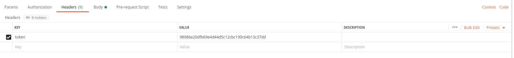
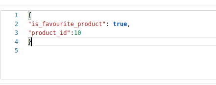
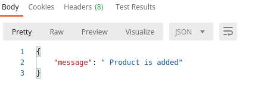

# APPLICATION USER_PROFILE

##### List of links 

>1. [Client](#get-list-of-client)
>2. [Service not_signed](#get-list-of-product-card)
>3. [service signed](#search-in-list-of-product-card)
>4. [Service create](#get-list-of-scope-of-product )
>5. [Get not signed doc](#get-list-of-attribute-type)
>6. [Service create](#get-list-attribute-of-product)
>7. [Signature](#get-list-of-category)
>8. [Signature check](#get-list-of-sub_category)
>9. [Favourite product](#get-list-of-brand)
>10. [Favourite branch](#get-list-of-product)

## Get list of client
#### Request method: GET

## [/account/client/](https://demoapp.baitushum.kg/account/client/) 

### Sample response

    [
        {
            "inn": "12345678901234"
        },
        {
            "inn": "22007199101028"
        },
        {
            "inn": "20910199600247"
        },
        {
            "inn": null
        },
        {
            "inn": null
        },
        {
            "inn": "22706198800981"
        }
    ]
    
    
    
## Get list of favourite product
#### Request method: GET
#### Request headers: Token

## [/account/client/](https://demoapp.baitushum.kg/account/favourite_product/) 

### Sample response

    {
        "count": 3,
        "next": null,
        "previous": null,
        "results": [
            {
                "id": 15,
                "price": 10,
                "branch": {
                    "id": 8,
                    "name": "branch1",
                    "address": "xsxs",
                    "logo": "http://127.0.0.1:8000/media/store/Screenshot_from_2020-10-08_21-32-28.png",
                    "phone": "xsxs"
                },
                "quantity": 1,
                "card_id": 7,
                "card_image": "http://127.0.0.1:8000/media/product_card/WhatsApp_Image_2020-07-26_at_12.57.36_1_uQNi6wi.jpeg",
                "card_name": "Стекло на Outback",
                "attribute_type": [
                    {
                        "id": 2,
                        "name": "size",
                        "tag_attribute_type": "SIZE",
                        "attributes": [
                            {
                                "id": 6,
                                "name": "medium",
                                "attribute_type": 2,
                                "tag_attribute": "MEDIUM"
                            }
                        ]
                    }
                ],
                "is_favourite": true
            },
            {
                "id": 19,
                "price": 5000,
                "branch": {
                    "id": 8,
                    "name": "branch1",
                    "address": "xsxs",
                    "logo": "http://127.0.0.1:8000/media/store/Screenshot_from_2020-10-08_21-32-28.png",
                    "phone": "xsxs"
                },
                "quantity": 1,
                "card_id": 7,
                "card_image": "http://127.0.0.1:8000/media/product_card/WhatsApp_Image_2020-07-26_at_12.57.36_1_uQNi6wi.jpeg",
                "card_name": "Стекло на Outback",
                "attribute_type": [
                    {
                        "id": 2,
                        "name": "size",
                        "tag_attribute_type": "SIZE",
                        "attributes": [
                            {
                                "id": 4,
                                "name": "big",
                                "attribute_type": 2,
                                "tag_attribute": "BIG"
                            }
                        ]
                    }
                ],
                "is_favourite": true
            },
            {
                "id": 20,
                "price": 100,
                "branch": {
                    "id": 8,
                    "name": "branch1",
                    "address": "xsxs",
                    "logo": "http://127.0.0.1:8000/media/store/Screenshot_from_2020-10-08_21-32-28.png",
                    "phone": "xsxs"
                },
                "quantity": 1,
                "card_id": 6,
                "card_image": "http://127.0.0.1:8000/media/product_card/WhatsApp_Image_2020-07-26_at_12.57.36_1_VjrGxpO.jpeg",
                "card_name": "Амортизатор для Outbacksss",
                "attribute_type": [
                    {
                        "id": 1,
                        "name": "color",
                        "tag_attribute_type": "COLOR",
                        "attributes": [
                            {
                                "id": 3,
                                "name": "white",
                                "attribute_type": 1,
                                "tag_attribute": "WHITE"
                            }
                        ]
                    }
                ],
                "is_favourite": true
            }
        ]
    }

    
## Create favourite product
#### Request method: POST
#### Request headers: Token

## [/account/client/](https://demoapp.baitushum.kg/account/favourite_product/) 

#### Request body: 

    {
        "is_favourite_product": true,
        "product_id":10
    }

### Sample response 

##### If "is_favourite_product": true, it will print message as 'Product is added to the favourite_product_list', else if "is_favourite_product": false, it will remove from favourite_product_list. WARNING: you should sent an existing product_id, in anather way it will give an error? that product does not exist. But anyway, Android/iOS developers will not display product which is not exists. 

### If "is_favourite_product": true

### If "is_favourite_product": false

